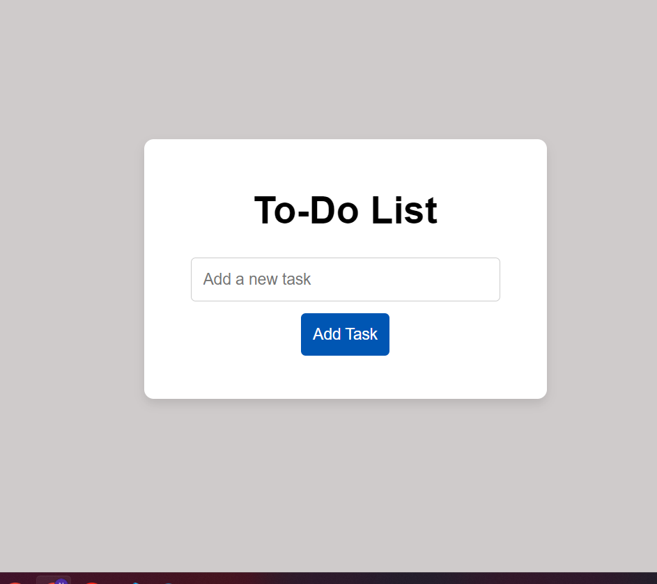
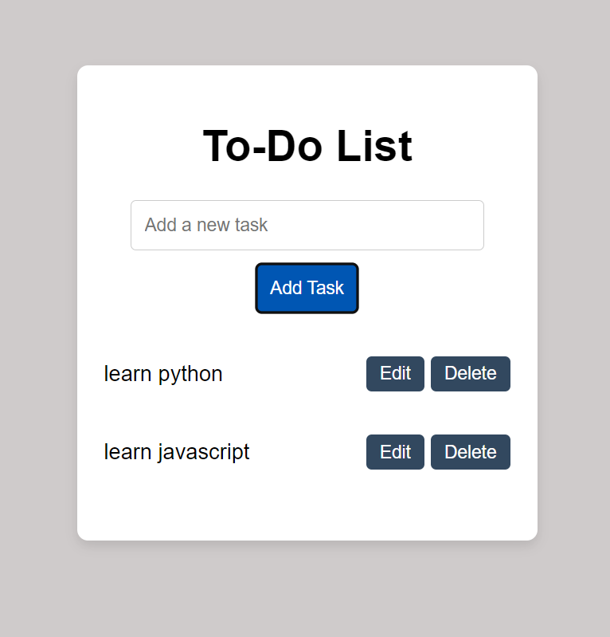
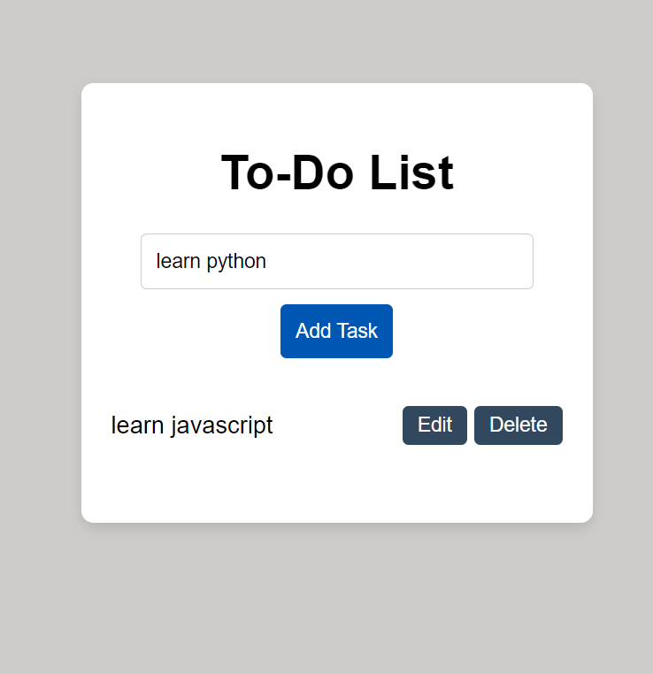
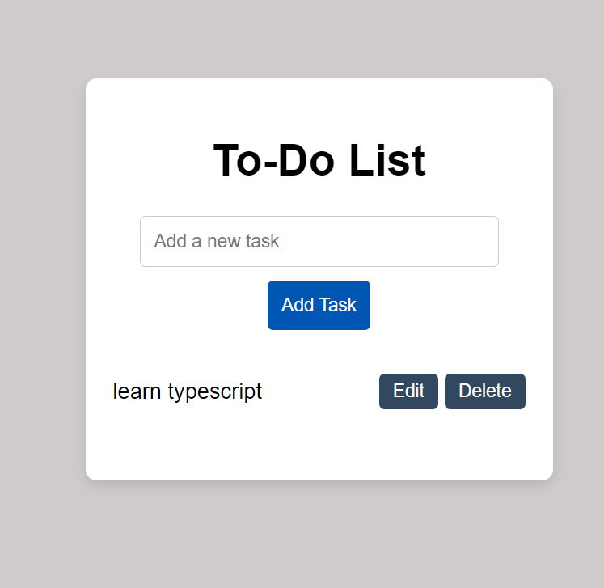

this is a to-do app that allow users to add,edit and delete a task
here is the step by step gideline

1) adding task: 
     - write your task 
     - click Add Task

example :
this is after inserting two tasks

2) edit task:
    - click edit button
    
    - edit your task
    - click Add Task

3) delete task:
    - click delete button
    

