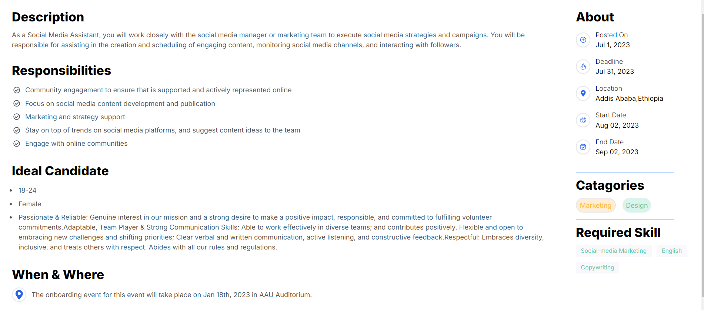

# Job Listing Application


Welcome to the Job Listing Application! This project is designed to provide users with a detailed list of job opportunities, allowing them to view job details, responsibilities, and ideal candidate traits. The application is built using React and Next.js.



## Features

- List of job postings
- Detailed job description view
- Job responsibilities and ideal candidate traits
- Job location and timing details
- Dynamic job count update

## Technologies Used

- React
- Next.js
- TypeScript
- Tailwind CSS
- Node.js
- JSON for job data storage


## Usage

Once the application is running, you can:

- View a list of job postings on the main page.
- Click on any job to view its details, including description, responsibilities, ideal candidate traits, and location/timing information.

## File Structure

The project file structure is as follows:

```plaintext
joblisting
│
├── components
│   ├── JobCard.tsx
│   ├── JobDetail.tsx
│   ├── JobList.tsx
│   └── About.tsx
│
├── pages
│   ├── api
│   │   └── jobs
│   │       └── route.ts
│   └── index.tsx
│
├── public
│   └── images
│
├── styles
│   └── globals.css
│
├── lib
│   └── jobs.json
│
├── .gitignore
├── README.md
├── next.config.js
├── package.json
└── tsconfig.json
```

### Components

- **JobCard**: Displays a brief overview of each job.
- **JobDetail**: Shows detailed information about a selected job.
- **JobList**: Fetches and displays the list of jobs.
- **About**: Displays additional information about the job.

### Pages

- **index.tsx**: The main page that renders the job list.

### API

- **route.ts**: Provides the API endpoint to fetch job data from the `jobs.json` file.