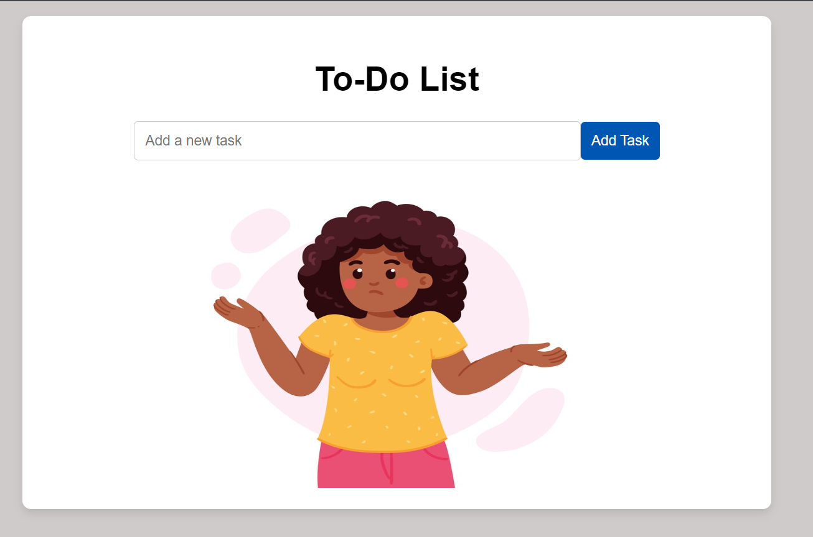
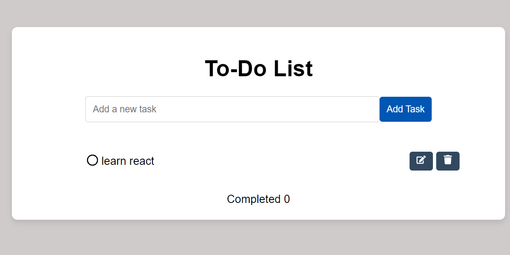
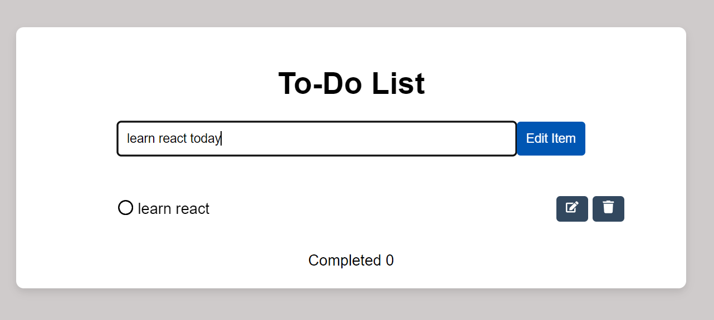
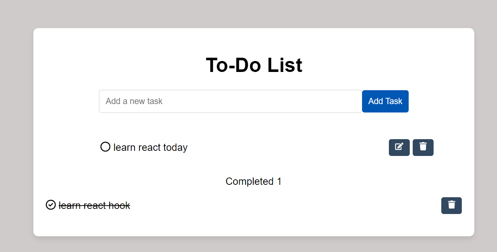
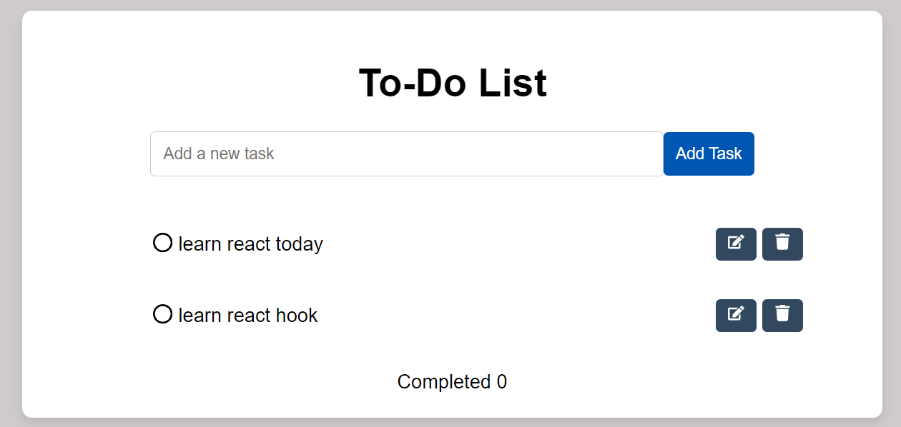

# README

## To-Do List Application

This project is a simple To-Do List application built with React. It allows users to add, edit, delete, and mark tasks as completed.

### Features

- Add new tasks
- Edit existing tasks
- Delete tasks
- Mark tasks as completed
- Move tasks back from completed to the to-do list

### Usage

1. To add a new task, enter the task description in the input field and click the "Add Task" button.

2. To edit a task, click the edit button (pencil icon) next to the task. The task description will appear in the input field. Make your changes and click the "Edit Item" button.

3. To delete a task, click the trash icon next to the task.

4. To mark a task as completed, click on the task description. The task will move to the completed section.

5. To move a task back from completed to the to-do list, click on the task in the completed section.


```

### Code Overview

#### `App.tsx`

This is the main component of the application. It maintains the state for the list of to-do items, completed items, the current input text, and the state for editing items.

#### `ListItem.tsx`

This is a functional component responsible for rendering the list of to-do items. It receives the list of to-do items and callback functions for editing, deleting, and marking tasks as completed as props.


Happy coding! 🚀